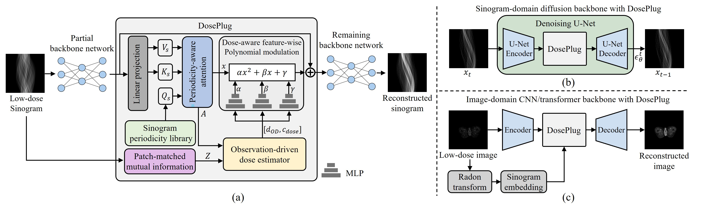
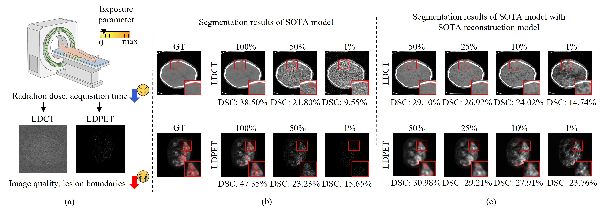
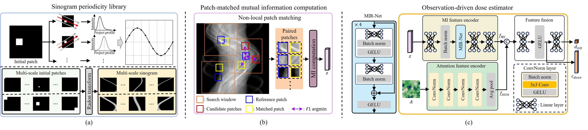
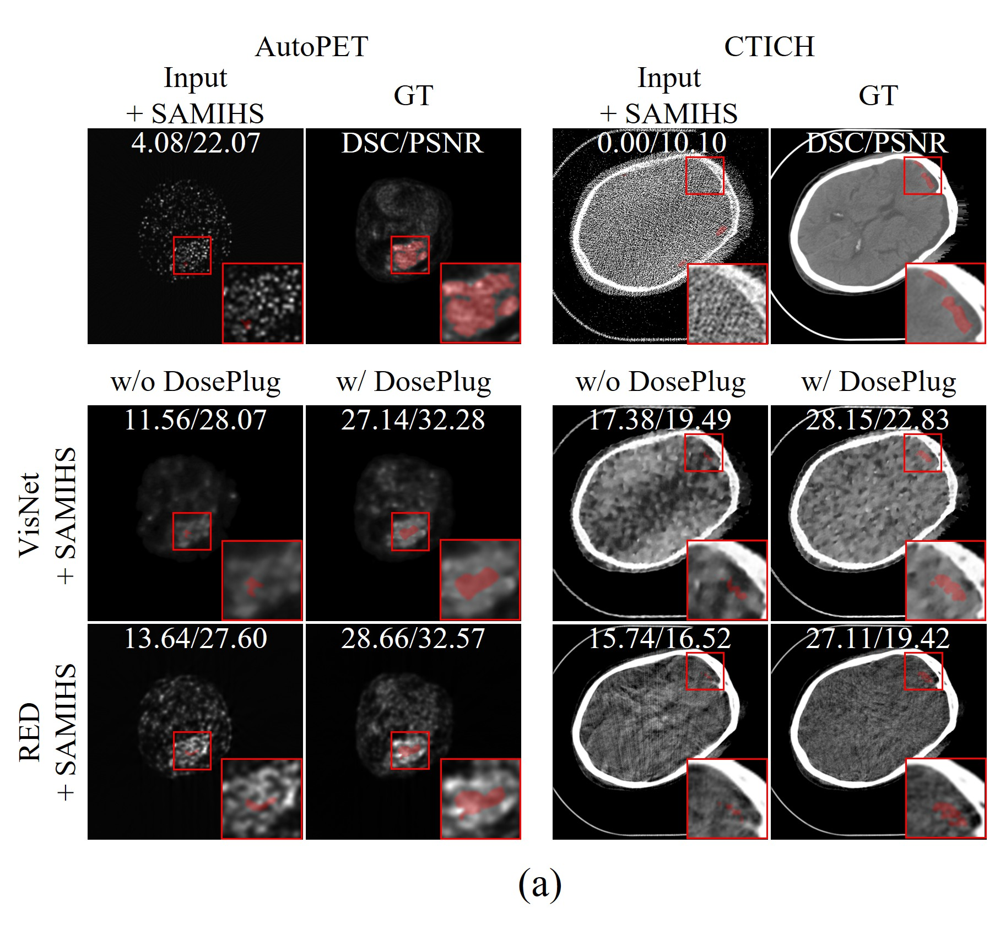

<!--
MAINTAINER NOTES (not displayed on GitHub)
- This is a paper landing page, not an installation guide.
- The Paper button assumes ./DosePlug_MICCAI2026.pdf in the repository root.
  Update all PDF links below if the uploaded filename differs.
- The code URL is taken from the author proof; verify public access before printing the QR.
- Numerical results are from the attached manuscript's Tables 1-3.
  The five-dose averages below are calculated, not newly run experiments.
- The BibTeX entry is an accepted-manuscript citation. Replace it with the official
  publisher export once final bibliographic details are confirmed.
- All image paths are relative. Upload the assets folder together with README.md.
-->

<h1 align="center">DosePlug</h1>

<h3 align="center">
Observation-Driven Dose Modeling for<br>
Robust Low-Dose Reconstruction and Segmentation
</h3>

<p align="center">
  
</p>

<p align="center">
  <b>Do Hyun Ki</b><sup>*</sup> &nbsp;·&nbsp;
  <b>Yeong Jong Lee</b><sup>*</sup> &nbsp;·&nbsp;
  <b>Seok Bong Yoo</b><sup>†</sup><br>
  <sub>* Equal contribution &nbsp; · &nbsp; † Corresponding author</sub>
</p>

<p align="center">
  Department of Artificial Intelligence Convergence<br>
  <b>Chonnam National University</b> · Gwangju, Korea
</p>

<p align="center">
  <a href="./DosePlug_MICCAI2026.pdf"></a>
  &nbsp;
  <a href="https://github.com/kikidohyun/DosePlug"></a>
  &nbsp;
  <a href="#citation"></a>
</p>

<p align="center">
  <b>A lightweight plug-in for dose-adaptive CT/PET reconstruction<br>
  and more robust lesion segmentation.</b>
</p>

<p align="center">
  <a href="#overview">Overview</a> &nbsp; / &nbsp;
  <a href="#method">Method</a> &nbsp; / &nbsp;
  <a href="#results">Results</a> &nbsp; / &nbsp;
  <a href="#resources">Resources</a>
</p>

---

## Overview

**DosePlug estimates observation-driven dose (OD-dose) from sinogram mutual information (MI) and periodicity cues, then adapts intermediate reconstruction features through polynomial modulation.** It supports image-domain CNN/Transformer and sinogram-domain diffusion backbones, without requiring dose metadata at inference.

<p align="center">
  <a href="assets/overview.jpg"></a><br>
  <sub>Overall architecture and backbone integration. Figure 2 of the paper. Click to enlarge.</sub>
</p>

<table>
  <tr>
    <td align="center" width="33%"><h3>13.10 K</h3>additional parameters</td>
    <td align="center" width="33%"><h3>+1.00%</h3>FLOPs overhead</td>
    <td align="center" width="33%"><h3>+0.67%</h3>latency overhead</td>
  </tr>
</table>

<p align="center"><sub>Measured with VisNet, as reported in Table 3(d). These are configuration-specific overheads, not universal costs for every backbone.</sub></p>

### Why model dose from observations?

Lower dose weakens lesion segmentation, even after reconstruction. Dose metadata can be unavailable or poorly aligned with the degradation that matters to the task. **OD-dose characterizes task-relevant corruption from the observed sinogram, rather than serving as a physical dose measurement.**

<details>
<summary><b>View the motivation: dose reduction and segmentation degradation</b></summary>

<p align="center">
  <a href="assets/motivation.jpg"></a><br>
  <sub>Figure 1 of the paper. Segmentation: SAMIHS. Reconstruction: VisNet for CTICH and RED for AutoPET.</sub>
</p>

</details>

## Method

### 1 · Periodicity-aware attention

A learnable **sinogram periodicity library (SPL)** guides cross-attention with backbone features to restore periodic structure. The pre-softmax query–key similarity is retained as a **periodicity alignment map**, providing a backbone-aware degradation cue.

### 2 · Observation-driven dose estimation

**Non-local patch matching** pairs similar sinogram patches before mutual information (MI) computation, reducing content-induced bias. Two lightweight encoders and a fusion head combine the MI descriptor with the periodicity alignment map to predict **OD-dose and a conditioning vector**.

### 3 · Dose-aware feature-wise polynomial modulation

**FwPM** uses the predicted dose and conditioning vector to produce channel-wise coefficients for second-order polynomial feature modulation:

$$
\hat{x} = \alpha \odot x^2 + \beta \odot x + \gamma.
$$

The modulated features are re-injected into the reconstruction backbone through a residual pathway.

> **Training versus inference.** The estimator is supervised by ground-truth dose ratios and jointly optimized with the reconstruction objective. Dose metadata is **not required at inference**.

<details>
<summary><b>View the internal modules and integration details</b></summary>

<p align="center">
  <a href="assets/method_details.jpg"></a><br>
  <sub>Internal components. Figure 3 of the paper.</sub>
</p>

| Reconstruction domain | Backbone family | Integration |
| :--- | :--- | :--- |
| Sinogram | Diffusion | Inserted at the denoising U-Net bottleneck. |
| Image | CNN / Transformer | A Radon transform and sinogram embedding provide the sinogram input for dose-aware feature modulation. |

See Sections 2.1–2.5 of the [paper](./DosePlug_MICCAI2026.pdf) for the complete formulation and training objective.

</details>

## Results

### Reconstruction and downstream segmentation

**Baseline → baseline + DosePlug.** Values below are arithmetic means over **1%, 5%, 10%, 25%, and 50%** dose ratios. DSC uses **SAMIHS** for downstream segmentation; reconstruction quality is reported as PSNR. Higher is better for both.

| Dataset | Reconstruction backbone | DSC (%) ↑ | PSNR (dB) ↑ |
| :--- | :--- | :---: | :---: |
| AutoPET | VisNet | 26.16 → **29.96** | 27.87 → **31.74** |
| AutoPET | RED | 27.51 → **30.94** | 29.36 → **31.95** |
| CTICH | VisNet | 23.19 → **26.80** | 26.52 → **30.57** |
| CTICH | RED | 20.63 → **23.99** | 20.57 → **23.68** |

<sub>Computed from the per-dose entries in Tables 1 and 2; these are dose-level averages, not averages over random seeds.</sub>

DosePlug improves DSC in **all 40 evaluated combinations** of two datasets, two reconstruction backbones, two segmentation methods, and five dose ratios in Table 1.

<details>
<summary><b>View the second segmentation method: SCUNet++</b></summary>

The same five-dose averaging is applied. Values are DSC (%), shown as **baseline → baseline + DosePlug**.

| Dataset | Reconstruction backbone | SCUNet++ DSC (%) ↑ |
| :--- | :--- | :---: |
| AutoPET | VisNet | 20.56 → **23.99** |
| AutoPET | RED | 21.85 → **24.90** |
| CTICH | VisNet | 18.22 → **21.71** |
| CTICH | RED | 14.84 → **19.01** |

<sub>Computed from Table 1.</sub>

</details>

### Qualitative examples at 1% dose

<p align="center">
  <a href="assets/qualitative.png"></a><br>
  <sub>Figure 4(a) of the paper. AutoPET and CTICH; values show DSC (%) / PSNR (dB). These are individual examples, not dataset averages.</sub>
</p>

### Real-world reconstruction

The paper also evaluates cross-dataset reconstruction on **AutoPET → UDPET** and **CTICH → Mayo LDCT**, using PSNR and SSIM. These real-world datasets lack lesion masks, so this evaluation covers **reconstruction only**, not real-world segmentation.

<details>
<summary><b>View the computational cost breakdown</b></summary>

| Metric | VisNet baseline | Added by DosePlug | Relative increase |
| :--- | ---: | ---: | ---: |
| Parameters | 338.22 K | 13.10 K | 3.87% |
| FLOPs | 124.91 G | 1.25 G | 1.00% |
| Latency | 300.75 ms | 2.02 ms | 0.67% |

<sub>Reported configuration in Table 3(d). Relative increases are with respect to the VisNet baseline.</sub>

</details>

## Resources

**[Read the paper](./DosePlug_MICCAI2026.pdf)** · **[Visit the code repository](https://github.com/kikidohyun/DosePlug)**

This repository is the paper landing page. The separate code repository linked above is the implementation link listed in the manuscript.

## Citation

Please cite our work using the accepted-manuscript entry below. For the final proceedings citation, use the publisher's bibliographic export when available.

```bibtex
@misc{ki2026doseplug,
  title  = {{DosePlug}: Observation-Driven Dose Modeling for Robust
            Low-Dose Reconstruction and Segmentation},
  author = {Ki, Do Hyun and Lee, Yeong Jong and Yoo, Seok Bong},
  year   = {2026},
  note   = {Accepted at MICCAI 2026},
  url    = {https://github.com/kikidohyun/DosePlug_MICCAI2026.pdf}
}
```

## Contact

**Seok Bong Yoo** · Corresponding author  
[sbyoo@jnu.ac.kr](mailto:sbyoo@jnu.ac.kr)

---

<p align="center">
  <sub>All figures and reported measurements are from the DosePlug paper. No new experiments are presented on this page.</sub><br>
  <sub>Chonnam National University · MICCAI 2026</sub>
</p>
